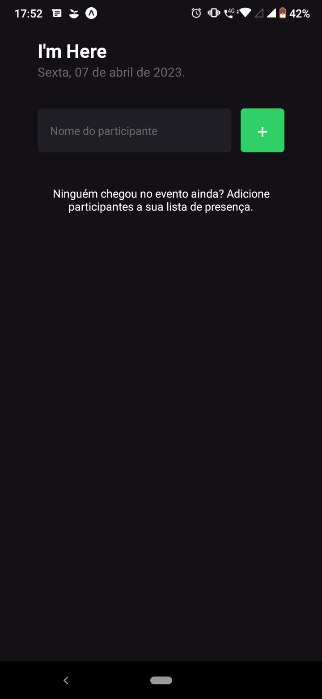
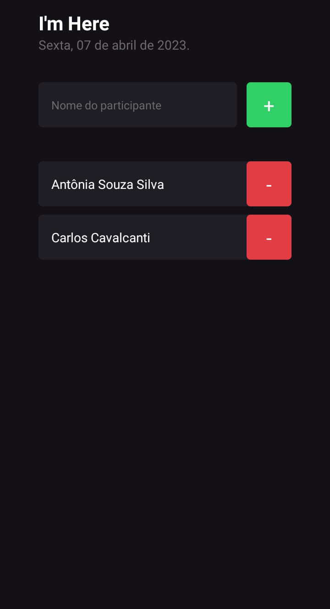
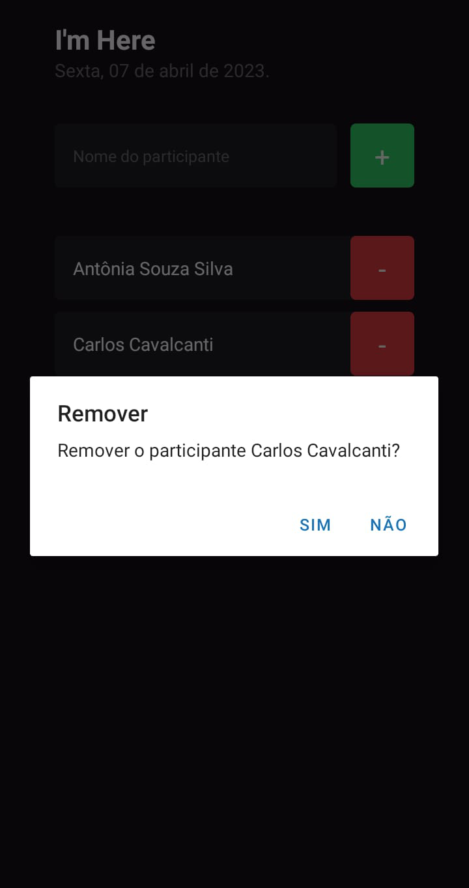

# I'm Here

## Aplicação para gerenciar os participantes presentes em eventos, como palestras e workshops, através da trilha Ignite da Rocketseat.

### ✔️  I'm Here 🚀 Concluído  ✔️







### Pré-requisitos

Antes de começar, você vai precisar ter instalado em sua máquina as seguintes ferramentas:
[Git](https://git-scm.com), [Node.js](https://nodejs.org/en/). 
Além disto é bom ter um editor para trabalhar com o código como [VSCode](https://code.visualstudio.com/) e também o [Expo Go] e [Expo CLI] (https://expo.dev/client) no seu celular, ou o emulador do [Android Studio] (https://developer.android.com/studio?gclsrc=ds&gclsrc=ds)

### 🎲 Rodando o App

```VSCode
# Clone este repositório
$ git clone <https://github.com/jessicaalines/imhere>

# No terminal bash digite o comando
$ expo start

# Escaneie o QR Code que aparecerá na tela no aplicativo do Expo Go no seu celular 


### 🛠 Tecnologias

As seguintes ferramentas foram usadas na construção do projeto:

- [Expo](https://expo.io/) 
- [JavaScript](https://developer.mozilla.org/)
- [React Native](https://reactnative.dev/)
- [TypeScript](https://www.typescriptlang.org/)


## 📧 Contato

- Email: jess.alineoliveira@gmail.com
- Linkedin: https://www.linkedin.com/in/jessica-aline-soares-oliveira/
- Instagram: https://www.instagram.com/codandocomjess/